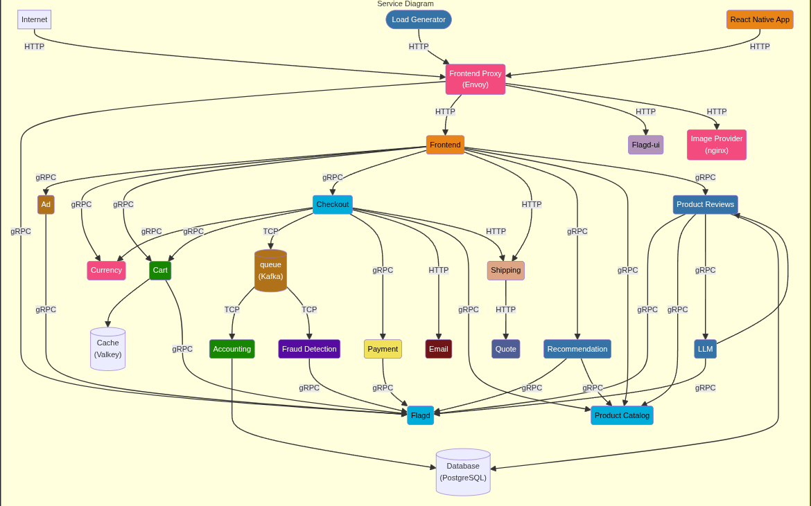

# Cloud-Native-Ecommerce-Deployment
**Architect:** Divya Anand | **Project Type:** DevOps / SRE Portfolio

## 📌 Project Overview

This project involves the complete infrastructure re-engineering of the **OpenTelemetry Demo App** — a production-realistic, polyglot microservices system chosen for its real-time service mesh, extensive documentation, and stability. While the base application logic is derived from the demo, the **core contribution of this project is the design and implementation of a production-grade DevOps lifecycle from scratch.** I stripped out all existing deployment configurations to architect a fresh, hardened environment featuring Infrastructure as Code (IaC), GitOps continuous delivery, and cross-runtime observability.

## 🏗 Service Architecture

The system consists of 10+ microservices communicating via **gRPC** and **HTTP**, built across Java, Go, Python, and Node.js. Services discover each other via Kubernetes service names injected as environment variables — no hardcoded IPs.

### 🛠 Technical Pillars
- **Infrastructure:** AWS (EKS, VPC, Route53, S3) provisioned via **Terraform**
- **Containerization:** Custom multi-stage builds focused on image size reduction and security
- **Deployment:** GitOps workflow managed by **Argo CD** for automated cluster synchronization
- **Monitoring:** Distributed tracing and metrics using **OpenTelemetry**, Prometheus, and Grafana

---

## 🚀 Execution Roadmap

### Phase 0: Project Initiation & Workspace Setup
- Provisioned an EC2 workspace (Ubuntu, t2.large) and performed volume expansion from 8GB → 30GB using `growpart` + `resize2fs` to support multi-container workloads.
- Engineered a clean repository structure separating infrastructure from source code.
- Mapped service dependencies (gRPC/HTTP) to define networking and security group rules.
- Applied a **zero-privilege IAM approach**: granted temporary admin access for initial setup, then revoked and re-issued scoped least-privilege policies to the working IAM user.

### Phase 1: Custom Containerization & Optimization
- **Rebuilt Dockerfiles from scratch** — removed all upstream configs and authored custom multi-stage builds for the three primary runtimes:
  - **Go** (`product-catalog-service`): built binary locally first, then distroless final image
  - **Java** (`ad-service`, Gradle-based): OpenJDK-Alpine builder stage, minimal runtime layer
  - **Python** (`recommendation-service`): analyzed `requirements.txt` and `main.py` directly, authored Dockerfile without upstream guidance
- Validated inter-service communication locally using a customized **Docker Compose** environment before moving to Kubernetes.
- Pushed versioned images to a Docker Hub organization registry.

### Phase 2: Infrastructure as Code (IaC) with Terraform
- Structured Terraform using a **modular approach** — separate modules for `vpc/` and `eks/`, invoked from a root `main.tf`.
- Implemented **Remote State Management** with S3 and DynamoDB state locking — backend configured before any other resources.
- Provisioned a modular **VPC** with public/private subnet isolation, internet gateway, NAT gateway, and per-subnet route tables.
- Deployed a highly available **Amazon EKS** cluster with two IAM roles:
  - One for the **control plane** (cluster) with EKS cluster policy attached
  - One for the **data plane** (node group) with EC2/worker node policies attached

### Phase 3: Kubernetes Orchestration & Security
- Authored native Kubernetes Manifests (Deployments, Services, ServiceAccounts, ConfigMaps).
- Configured dedicated **ServiceAccounts** per workload rather than relying on the default — following least-privilege principles at the pod level.
- Evaluated service exposure types (`ClusterIP` → `NodePort` → `LoadBalancer`) and identified `LoadBalancer` limitations: not declarative, cost-inefficient, inflexible at scale.
- Deployed **AWS ALB Ingress Controller** (not Nginx) for path-based routing — installed via official AWS documentation.
- Configured custom domain routing via Route 53 hosted zone connected to ALB DNS.

### Phase 4: CI/CD & GitOps Integration
- **CI (GitHub Actions):** Developed pipelines per microservice for automated linting, security scanning (Trivy), and image publishing. Secrets managed via repository-level `DOCKER_USERNAME`, `DOCKER_TOKEN`, and `GITHUB_TOKEN`.
- **CD (Argo CD):** Installed in a dedicated `argocd` namespace. Implemented a GitOps "Pull" model — EKS cluster monitors the `/k8s` directory and auto-reconciles on push.

### Phase 5: Full-Stack Observability
- Integrated **OpenTelemetry** for end-to-end distributed tracing across the polyglot stack.
- Configured custom **Grafana** dashboards to monitor gRPC latencies and pod resource utilization.

---

## 💡 Key Engineering Achievements
- **Infrastructure Automation:** Reduced environment spin-up from hours to minutes using modular Terraform.
- **Security Hardening:** Zero-privilege IAM, non-root container users, distroless images, Trivy image scanning.
- **Self-Healing Cluster:** Argo CD ensures zero-drift between Git state and Production at all times.
- **Real Decision-Making:** Chose ALB Ingress Controller over LoadBalancer type after evaluating cost, flexibility, and declarative config tradeoffs.